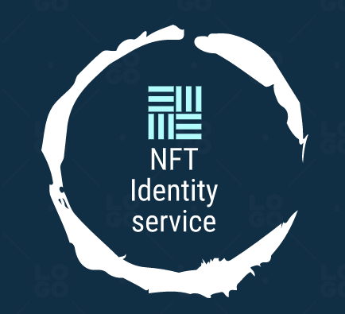

# NFT Identity project for Cosmos

General architecture, based on Delphi's [RFP](https://www.notion.so/5a6c1afdce6646d6b21f1184502ae039).

See [README](https://github.com/gabrielfior/nft-identity/tree/main/nft-tag-minter-dapp) for a description of Cosmos contracts and [README](https://github.com/gabrielfior/nft-identity/tree/main/backend) for a description of the backend.
